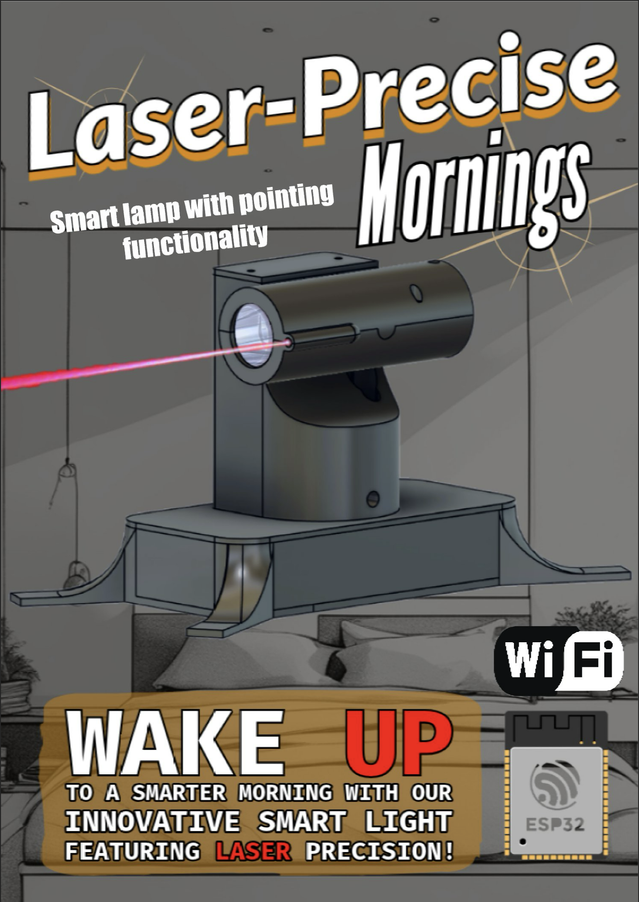

# Smart Spotlight

## Overview

**Smart Spotlight** is a sophisticated IoT lighting device built for those who appreciate innovative, advanced technology in their homes. Powered by an ESP32 microcontroller, this device combines intelligent lighting with motorized orientation and real-time weather functionality. **Smart Spotlight** delivers a seamless and responsive user experience, serving as a reliable weather display and an advanced "sunrise alarm" to provide a natural wake-up experience.

**Website**: [Smart Spotlight](https://smart-spotlight.vercel.app/)

**Images**: 



### Key Features

- **Field-Oriented Control (FOC) on Two-Axis Gimbal**: The spotlight is mounted on a motorized two-axis gimbal that uses FOC for precise and efficient control. This setup enables smooth movement and positioning, making it an ideal addition to smart home systems where user comfort and automation are priorities.
- **Sunrise Alarm**: Emulating a sunrise effect, Smart Spotlight gradually brightens to help users wake up more gently compared to traditional alarms. This is achieved through custom programming on the ESP32 to control LED intensity in sync with the alarm.
- **Weather-Based Illumination**: Integrating weather APIs, Smart Spotlight can display real-time weather information directly through light-based cues (such as color and brightness), providing users with instant insights into the day's conditions as soon as they wake up.

## Technical Architecture

This project leverages advanced IoT and embedded systems concepts, including:

- **Embedded System (ESP32)**: The ESP32 microcontroller drives the entire system, from motor control to wireless communication. Its dual-core architecture and WiFi capabilities make it ideal for handling real-time operations and IoT connectivity.
- **Motor Control Using FOC**: The motorized gimbal uses Field-Oriented Control, a complex method for controlling the two-axis gimbal’s BLDC motors, ensuring stable and precise spotlight movement.
- **WiFi Connectivity**: The ESP32 connects to WiFi to fetch weather data from a cloud API, delivering real-time weather updates to the user in a visually engaging format.
- **Custom PCB Design**: A custom PCB is designed to integrate the ESP32, motor drivers, and power management circuitry, providing a compact and efficient layout for reliable performance.

## User Guide

### Target Audience

The Smart Spotlight appeals to tech enthusiasts, smart home users, and anyone interested in blending functional and engaging technology into their daily routine.

### Competing Solutions

While smartphone apps offer similar alarm and weather functions, Smart Spotlight distinguishes itself by providing a visually immersive experience. Unlike traditional alarms, the sunrise simulation offers a natural wake-up method, and the device’s design complements modern smart home environments.

### Unique Value Proposition

Smart Spotlight is ideal for users seeking:
- A sophisticated and non-intrusive wake-up experience.
- A seamless blend of IoT and ambient lighting to provide immediate information on weather.
- A novel smart home device that combines advanced motor control with intelligent lighting.

## Getting Started

### Requirements

- **Hardware**:
    - ESP32 microcontroller
    - Two BLDC motors for gimbal control
    - Power supply (5V or 12V, depending on configuration)
    - LEDs with programmable brightness
    - Custom PCB (optional for integration)
- **Software**:
    - Arduino IDE or PlatformIO for firmware development
    - Weather API (such as OpenWeather API) for real-time data

### Installation

1. **Clone the repository**:
   ```bash
   git clone https://github.com/tuanvukng01/smart-spotlight.git
   
    cd smart-spotlight
    ```
   
2.	**Configure the firmware:**

   •	Open the code in Arduino IDE or PlatformIO.

   •	Update WiFi credentials and Weather API key in the configuration file.
3.	**Upload firmware:**

   •	Connect the ESP32 via USB and upload the code.
4.	**Calibrate the gimbal:**

   •	Use provided tools to calibrate the gimbal’s movement for smooth, precise control.

### Usage

Once the device is configured and connected to WiFi, it will automatically:

•	Retrieve weather data from the cloud and adjust lighting accordingly.

•	Activate the sunrise alarm sequence based on user-defined wake-up time settings.

### Contributing

This project is open to contributions from developers and IoT enthusiasts. Please open an issue or submit a pull request for any enhancements.

### License

This project is licensed under the MIT License. See the LICENSE file for details.

With Smart Spotlight, experience a new era of intelligent lighting and wake up refreshed every day.

